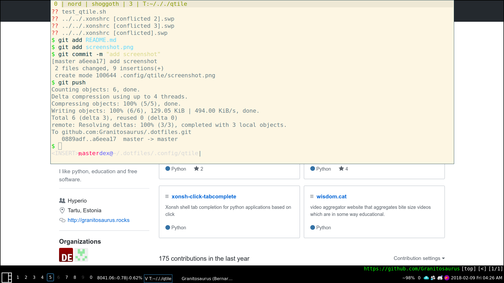

# Full Modern Qtile Config

This config features:

* Clean layout 
* Drop down terminal
* Sane keybinds
* Modular configuration, split across multiple files

This config is split into modules:

* keys - hotkeys and keybindings
* layouts - screen layouts
* solarized - solarized colors
* config - main config file that imports everything and is used by Qtile

Additional module:

* dropdown - dropdown terminal logic (should be available in the newest qtile upstream version)
* widgets - contains custom widgets, in this case crypto currency tracker widget.
* scratchpad - scratchpad logic (unused in this config at the moment)

Additional scripts:

* test_qtile.sh - script for testing qtile configs using [xephyr](https://wiki.archlinux.org/index.php/Xephyr)
